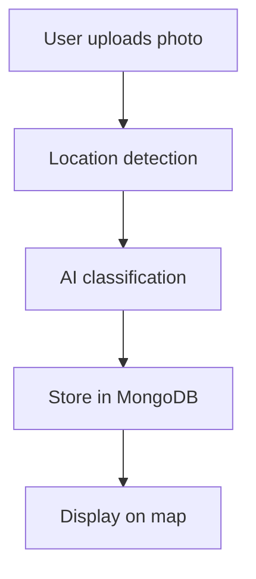

# FixMyNagar 🏙️
**Civic Problem Reporter with AI-Powered Classification**

[](https://opensource.org/licenses/MIT)
[](https://nodejs.org/)
[](https://reactjs.org/)
[](https://mongodb.com/)
[](https://tensorflow.org/)

## 🎯 Problem Statement

Citizens encounter civic issues like potholes, garbage dumps, water leaks, and broken streetlights daily, but face challenges in:
- **Lack of accessible reporting channels** - Most people don't know where to complain
- **Poor response from authorities** - Issues remain unaddressed until multiple complaints are filed
- **Zero transparency** - No tracking or status updates on reported problems
- **Complex reporting processes** - Platforms like CPGRAMS require extensive documentation
- **Language barriers** - Limited multilingual support for diverse communities

## 🚀 Solution: FixMyNagar

A comprehensive web and mobile platform that democratizes civic problem reporting through:

### **Core Features**
- 📸 **One-Click Reporting**: Upload photo + location with optional description
- 🤖 **AI-Powered Classification**: Automatic problem categorization using computer vision
- 🗺️ **Interactive Problem Mapping**: Location-based visualization of civic issues  
- 👍 **Community Validation**: Upvoting system for issue priority ranking
- 📊 **Real-time Tracking**: Status updates from Unresolved → In Progress → Resolved
- 💬 **Community Engagement**: Comments and feedback on reported problems
- 🌐 **Multilingual Support**: Available in English, Hindi, Bengali, Marathi, Tamil, Telugu
- 🔐 **Secure Authentication**: OTP-based passwordless login system

### **Admin Dashboard**
- 🗂️ **Centralized Issue Management**: View all reported problems on interactive maps
- ⚡ **Quick Status Updates**: Mark issues as resolved or in-progress
- 📈 **Analytics Dashboard**: Track resolution rates and community engagement
- 🔗 **CPGRAMS Integration**: Direct escalation to official government portals

## 🛠️ Tech Stack

### **Frontend**
- **Framework**: React.js + Vite (fast development & optimized builds)
- **Mapping**: Leaflet + OpenStreetMap (open-source mapping solution)
- **Geolocation**: IP-API + LocationIQ (accurate location detection)
- **Styling**: Modern responsive design with mobile-first approach

### **Backend**
- **Runtime**: Node.js + Express.js (scalable server architecture)
- **Database**: MongoDB Atlas (cloud-native document database)
- **Image Storage**: Cloudinary CDN (optimized image delivery)
- **Authentication**: JWT tokens in HTTP-only cookies + OTP verification

### **AI/ML Pipeline**
- **Model**: Custom-trained EfficientNet-Lite0 / MobileNetV3-Small
- **Framework**: TensorFlow Lite (mobile-optimized inference)
- **Categories**: Automatic classification of civic issues (potholes, garbage, lighting, water, etc.)

### **Mobile App**
- **Platform**: Native Android (Java + XML)
- **Features**: Camera integration, GPS location, offline capability

## 📋 API Architecture

### **Core Endpoints**
```
POST   /api/report              # Submit new civic issue
GET    /api/issues              # Fetch nearby issues
POST   /api/issues/:id/upvote   # Upvote existing issue  
POST   /api/issues/:id/comment  # Add comment to issue
POST   /api/classify            # AI model classification
```

### **Admin Endpoints**
```
GET    /api/admin/issues        # Fetch all pending issues
POST   /api/admin/issues/:id/status  # Update issue status
GET    /api/admin/analytics     # Get resolution metrics
```

### **Authentication**
```
POST   /api/auth/signup         # User registration with OTP
POST   /api/auth/login          # OTP-based login
POST   /api/auth/verify-otp     # OTP verification
POST   /api/auth/logout         # Secure logout
```

## 🔄 Complete Workflow

### **1. Issue Reporting**


### **2. Community Engagement**
- Users can upvote similar issues they've encountered
- Comments provide additional context and updates
- Popular issues get higher visibility and priority

### **3. Admin Resolution**
- Admins review issues on centralized dashboard
- Status updates notify community of progress
- Integration with CPGRAMS for official escalation

## 🔧 Installation & Setup

### **Prerequisites**
- Node.js 18+ and npm/yarn
- MongoDB Atlas account
- Cloudinary account
- LocationIQ API key

### **Backend Setup**
```bash
cd backend
npm install
cp .env.example .env  # Configure environment variables
npm run dev
```

### **Frontend Setup**
```bash
cd frontend  
npm install
npm run dev
```

### **Environment Variables**
```env
MONGODB_URI=your_mongodb_connection_string
CLOUDINARY_URL=your_cloudinary_url
LOCATIONIQ_API_KEY=your_locationiq_key
JWT_SECRET=your_jwt_secret
OTP_SERVICE_KEY=your_otp_service_key
```

## 📱 Mobile App

The Android app provides native mobile experience with:
- **Camera Integration**: Direct photo capture for issue reporting
- **GPS Location**: Automatic location detection and manual address input  
- **Offline Mode**: Queue reports when internet is unavailable
- **Push Notifications**: Updates on reported issue status

## 🌟 Advanced Features

### **AI Classification Pipeline**
- **Custom Training**: Model trained on Indian civic infrastructure dataset
- **Multi-category Detection**: Potholes, garbage, street lights, water issues, etc.
- **Confidence Scoring**: Ensures accurate categorization
- **Continuous Learning**: Model improves with community feedback

### **Escalation System**
- **Automated Escalation**: Issues with high upvotes auto-escalate after 5 days
- **CPGRAMS Integration**: Direct submission to government grievance portal
- **Multi-level Authorities**: Route to appropriate municipal departments

### **Analytics & Insights**
- **Hotspot Detection**: Identify areas with frequent civic issues
- **Resolution Metrics**: Track government response times
- **Community Engagement**: Monitor user participation and feedback

## 🚀 Future Roadmap

### **Phase 2: Blockchain Integration**
- Immutable issue tracking and resolution verification
- Transparent fund allocation for civic improvements
- Community-driven governance mechanisms

### **Phase 3: Gamification**
- **Reward System**: Points and badges for active community members
- **Leaderboards**: Recognize top contributors and issue reporters
- **Municipal Partnerships**: Official collaboration with local governments

### **Phase 4: Advanced AI**
- **Real-time Translation**: Automatic translation of reports across all supported languages
- **Progress Verification**: AI-powered verification of issue resolution
- **Predictive Analytics**: Forecast potential civic problems before they occur

### **Phase 5: Service Marketplace**
- **Direct Hiring**: Connect communities with verified cleaners and fixers
- **Service Ratings**: Community-driven quality assurance
- **Emergency Response**: Priority routing for urgent civic issues

## 🏆 Competitive Advantages

1. **AI-First Approach**: Automated issue classification reduces manual effort
2. **Community-Driven**: Upvoting system ensures democratic prioritization  
3. **Multilingual by Design**: Serves India's diverse linguistic communities
4. **Government Integration**: Direct pipeline to official grievance channels
5. **Mobile-Optimized**: Lightweight AI models for real-time mobile inference
6. **Passwordless Security**: OTP-based authentication reduces security vulnerabilities

## 🤝 Contributing

We welcome contributions from the community! Please see our [Contributing Guidelines](CONTRIBUTING.md) for details on:
- Code standards and best practices
- Issue reporting and feature requests  
- Pull request process and review guidelines

## 📄 License

This project is licensed under the MIT License - see the [LICENSE](LICENSE) file for details.

## 👥 Team

Built with ❤️ for creating transparent, accountable civic infrastructure.

---

**FixMyNagar** - Because every neighborhood deserves better infrastructure! 🏘️✨
